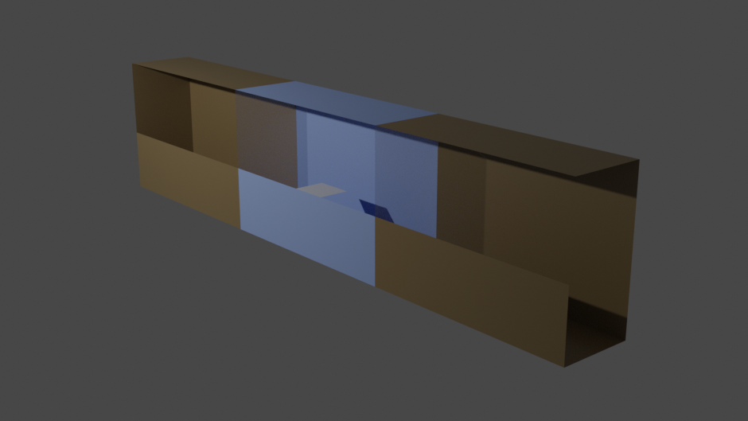

# Garden Sun Calculator

This garden sun calculator is an easy tool for the calculation of sun exposure of different parts of a garden or balcony. This exposure can then be used to make better planting plans in garden or balcony designs.

The calculator consists of three parts, there is a wavefront parser to import the garden or balcony geometry, a sun tracker that gives the direction of the sun as a function of time and a very rudimentary ray tracer to compute the sun exposure. Besides the calculator also some python scripts are provided that help with visualizing the results.

## Dependencies and Build
The calculator uses functionaly from the Eigen and Boost libraries, see http://eigen.tuxfamily.org/ and https://www.boost.org/ and for parallelization OpenMP is used.

To build the garden sun calculator:
```bash
git clone https://github.com/rubengerritsen/GardenSunCalculator
cd GardenSunCalculator
mkdir build
cd build
cmake ..
cmake --build .
```

## Different Modes
The calculator can be run in different modes, we have:

* `growseason`: computes the average daily sun exposure averaged over the growing season (May until September).
* `monthly`: computes the average daily sun exposure for every month separately.
* `hourly`: computes the average sun exposure per hour for a day indicated by the date option in the .xml file.
* `specificmoment`: computes the shadow at the specific moment specified in the option file.

## Example
As an example for the use of this calculator we consider a balcony with two neighbouring balconies. Due to the closed balustrade large parts of the balcony lie in the shade, the question we want to answer here is how much sun the different parts of the balcony get. 


### Define The Geometry
The first step in anwering this question is creating the geometry of the balcony and all objects that can contribute to shade on the balcony, in this case the neighbouring balconies. The geometry can be drawn in tools such as Blender or SketchUp as long as they output a Wavefront object (.obj)) file and material library (.mtl) (the latter is only used for the opacity of materials).

### Setup The Garden Sun Calculator (Using the Optionfile)
Once the geometry is generated the Garden Sun Calculator (GSC) can be used. To use it we need to setup an option file (.xml) an example file is provided: `include/options.xml`. 

Set the latitude, longitude, date and timezone to the correct place and time on earth. 

The simulator can be run in different modes via the `mode` option, for this example `growseason` is used.

The options `maxHeight` and `heightIncr` are used to indicate at which heights the sun exposure should be calculated. The calculator starts at a height given by the region (see below) and moves towards `maxHeight` in steps of `heightIncr`. 

The option `geometryFile` is used to point the calculator to the geometry. The option `geometryRotation` indicates how the geometry file is rotated with respect to true north. In the calculation it is assumed that the z-axis points up in the sky, the x-axis to the north and the y-axis to the west. The rotation can be used to rotate the system around the z-axis such that the true north direction of the geometry file and the x-axis of the calculator can be aligned. In this example the geometry file should be rotated about 8 degrees counterclockwise.

We only need to calculate the sun/shadow on the middle balcony and not on the other balconies, to indicate where we want to calculate the shadows/sun we can use the region options. `regionO` is a vector giving the origin of the region of interest. `regionV1` is a vector pointing to one of the corners of a rectangle and `vegionV2` points to another corner, such that `regionV1`, `regionO` and `regionV2` form an L shape and hence define a rectangle.

Finally we can set the number of steps (the resolution) used in the calculator (`stepsV1` and `stepsV2`), this can be set for both directions of the rectangle seperately, and the number of threads used to do the ray tracing (`nrOfThreads`).

### Running The Calculator
Once the option file is created running the calculation is simple.

```bash
./GSC -o path/to/options.xml
```

The calculator will create its own output directory based on the option `outputPath` in the .xml file. 

### Using The Results
The results have been put in a folder, one file is generated for every height/hour/month considered (depending on the calculator mode). For the `growseason` mode the python script `visualizeExample/exampleVisualization.py` has been used to generate the following figures from the data


We see the daily hours of direct sunlight for the different regions on the balcony at different heights, averaged over the growing season (May until September). Note that we can see the shadow of the table and that the balcony has very different zones when it comes to lighting, there are very dark zones, in particular the bottom and top (due to the balcony of the neighbours above), while in the middle there is a part where there is enough light to grow almost any plant.

This brings us to the last part of this example where we changed the colormap to indicate lighting zones, blue is used for shaded areas and hence the regions are suited for shade loving plants, the green zones are semi-shade (this semi-shade thing is always a bit difficult with planting, two things can be meant, either semi-shade i.e. a short period of direct sunlight the rest shade or they mean dappled-shade which occurs if plants are constantly exposed to sunlight but for example through the canopy of a tree. This calculator calculates the former.) and the orange can be classified as full sun. In the Figure below we have the zoned output, which is generated with the same python script but a different color map.

